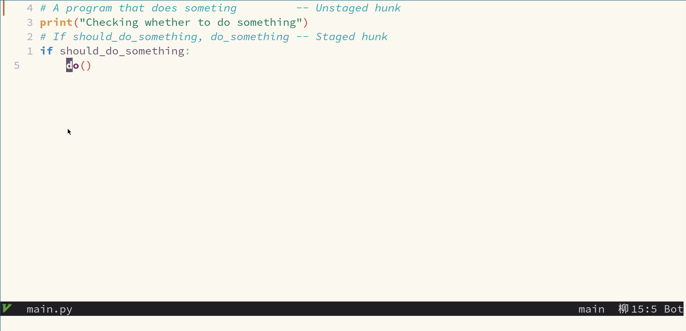

# nvim-git-fixer :wrench:

Create `fixup!`, `amend!`, `reword!` or `squash!` commits with ease. (See the `--autosquash` option of `git rebase` for further information about these commit types)



## Installation

```vim
Plug 'LhKipp/nvim-git-fixer'
Plug 'tpope/vim-fugitive' " Required

" Needed for stage_hunk, undo_stage_hunk and refresh actions. But can be swapped out. See configuration below.
Plug 'lewis6991/gitsigns.nvim'

" Either use telescope or fzf-lua to pick commits ... or code your own (see below)
Plug 'nvim-telescope/telescope.nvim'
Plug 'ibhagwan/fzf-lua'
```

Don't forget to call setup :smirk:
```lua
require('fixer').setup{}
```

## Usage

```lua
-- Create a `fixup!` commit only with the contents of the hunk under the cursor.
-- Use telescope to select the commit.
require('fixer/picker/telescope').commit{hunk_only=true, type="fixup"} 

-- Create an `amend!` commit with the contents of the index.
-- Use fzf-lua to select the commit.
require('fixer/picker/fzf_lua').commit{type="amend"}

-- The following options can be passed to a picker
-- {
--   hunk_only = true | false
--   type      = "fixup" | "amend" | "reword" | "squash"
-- }

-- For convenience:  Create a 'normal' commit with the contents of the hunk under the cursor
require('fixer').commit_hunk()
```

Note: When only commiting the hunk under the cursor (`hunk_only=true`), `nvim-git-fixer` will try to stash the index only. Git does not offer such a functionality. Therefore a technique as explained here https://stackoverflow.com/a/60925924 is used. This method is not perfect (but it works in 95% of all situations on my machine :upside_down_face:)

## Configuration
Currently the configuration only allows to pick a different plugin to do stage hunk actions.
```lua
-- defaults shown --
require('fixer').setup{
    stage_hunk_action = function () require("gitsigns").stage_hunk() end,
    undo_stage_hunk_action = function () require("gitsigns").undo_stage_hunk() end,
    refresh_hunks_action = function () require("gitsigns").refresh() end,
}
```

You can also write your own commit-hash-picker. The basic logic is:
```lua
local fixer = require('fixer')

local commit_only_current_hunk = true
local commit_type = "fixup" -- Or "amend", "reword", "squash"
local hash = pick_hash() -- Your magic function here

if commit_only_current_hunk then
    fixer.start_single_hunk_commit()
end
fixer.commit(commit_type, hash)
if commit_only_current_hunk then
    fixer.finish_single_hunk_commit()
end
```
